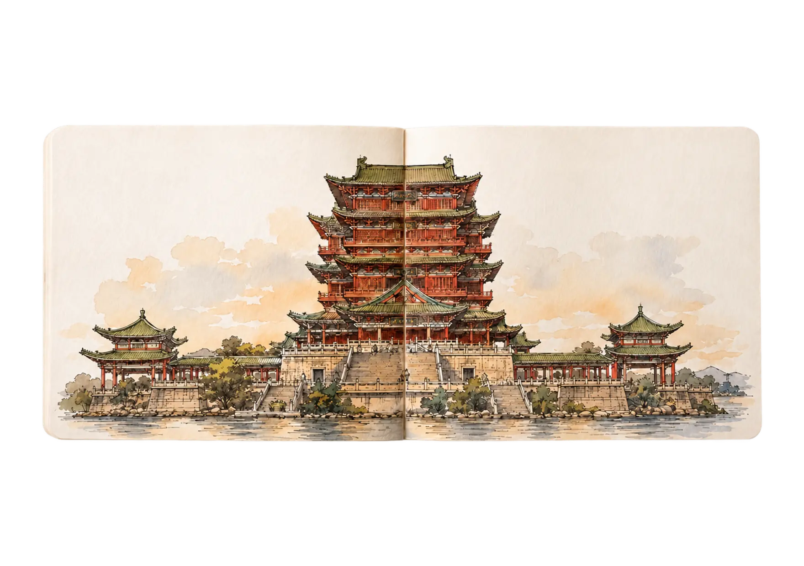

# 赣鄱山水 · 江西旅行画册

一本可以翻页、缩放和用放大镜探索的江西水彩旅行画册。

项目以九幅开放书本跨页串起江西的山水、古建、村落、窑火与城市记忆。拖动纸页时，页面会像真实纸张一样弯曲；把黄铜放大镜移到画面上，可以查看水彩和线稿的局部细节。



## 九处风景

1. 滕王阁 · 南昌
2. 庐山 · 九江
3. 景德镇御窑 · 景德镇
4. 婺源篁岭 · 上饶
5. 三清山 · 上饶
6. 龙虎山 · 鹰潭
7. 武功山 · 萍乡
8. 井冈山 · 吉安
9. 江南宋城 · 赣州

景点组合兼顾了自然山水、历史建筑、陶瓷文化、传统村落与红色文化。庐山、三清山和龙虎山的地貌与文化信息参考了 UNESCO 世界遗产资料：

- [Lushan National Park](https://whc.unesco.org/en/list/778/)
- [Mount Sanqingshan National Park](https://whc.unesco.org/en/list/1292/)
- [China Danxia](https://whc.unesco.org/en/list/1335/)

## 交互

- 拖动书页翻页，拖动速度会影响页面落下或回弹。
- 使用左右箭头、画面两侧热区或键盘方向键切换景点。
- 拖动放大镜查看局部水彩细节。
- 使用工具栏缩放画册，双击恢复到 100%。
- 通过下方景点索引直接跳到指定跨页。
- 触屏设备自动隐藏放大镜并改用点击翻页。
- `prefers-reduced-motion` 会跳过开场连续翻页并减少动画。

## 技术实现

- 原生 HTML、CSS 和 JavaScript，无框架、无第三方运行时依赖。
- 主要布局、样式、翻页几何、状态机和交互都位于 `index.html`。
- 翻页纸张由 18 个嵌套窄条构成，通过 CSS 3D、正反面、逐帧光影和弹簧动画模拟弯曲。
- 放大镜克隆当前书页，使用圆形 Mask 和坐标变换显示约 2.3 倍的局部内容。
- 九张插画统一为 1760 × 1240、带透明通道的 WebP，合计约 1.32MB。

## 本地运行

```sh
python3 -m http.server 4173
```

然后打开 `http://localhost:4173`。直接打开 `index.html` 也可以，但通过 HTTP 加载字体更稳定。

## 部署

仓库内置 GitHub Pages 工作流。推送到 `main` 后，可在仓库的 **Settings → Pages** 中选择 **GitHub Actions** 作为 Source。

## 改编与署名

本项目 Fork 并改编自 [MengTo/sketchbook](https://github.com/MengTo/sketchbook)，原项目概念参考了 [matthewyuart/personalportfolio](https://github.com/matthewyuart/personalportfolio)。江西版保留了原项目的翻页、放大镜、视差和缩放交互，并重新制作了全部景点插画、中文内容、元数据与资源加载方案。

九张江西插画使用 AI 图像生成制作，并根据真实景点的建筑和地貌特征统一构图、透明背景和画册尺寸。

## 授权说明

上游仓库当前没有提供明确的开源许可证。本 Fork 不额外声明对上游代码的再授权；复制、分发或商用前，请确认已获得上游作者许可。江西版新增插画和文字内容同样不因仓库公开而自动授予商用授权。
